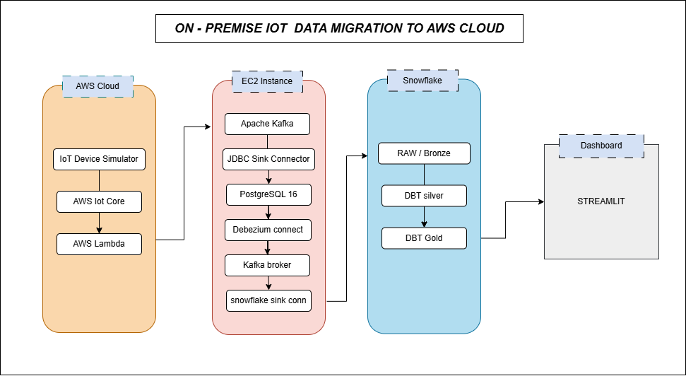

# IoT Real-Time Data Pipeline — On-Premise IoT Data Migration to AWS Cloud

**Data Engineering Hackathon — Batch 03**
**Author:** Qasim Hassan · Lead Instructor, Cloud & Data Engineering, Saylani Mass IT Training (SMIT)

A complete, working, end-to-end real-time data pipeline built for the hackathon: simulated IoT sensor data flows through AWS IoT Core, gets captured via change-data-capture, streams through Kafka, lands in Snowflake, is transformed through a dbt Medallion architecture (Bronze → Silver → Gold), and is visualized in a live, auto-refreshing Streamlit dashboard.



**Demo Video:** https://youtu.be/Y3aAAtWhU0A

---

## A note on architecture choices

The original hackathon brief specifies AWS-managed services throughout Phase 1 (AWS IoT Device Simulator, Kafka via MSK, Kafka Connect via CDK-provisioned infrastructure, AWS DMS). This implementation instead runs the Kafka ecosystem **self-hosted on a single EC2 instance via Docker Compose**, for three reasons:

1. **AWS's own IoT Device Simulator solution was officially deprecated in January 2025** and receives no further updates — it was still deployed here (Phase 1 simulation), but the downstream pipeline was built to be resilient and portable rather than dependent on AWS-managed streaming infra.
2. A self-hosted Kafka/Kafka Connect/Postgres stack is faster to iterate on, fully reproducible via one `docker-compose.yml`, and costs nothing beyond the EC2 instance itself — appropriate for a time-boxed hackathon build.
3. Every core requirement in the brief is still met: MQTT ingestion via real AWS IoT Core, CDC via Debezium, Kafka as the transport layer, Snowflake as the warehouse, dbt for Medallion transforms, and a live dashboard.

The bonus Timestream + Grafana path (Task 2.5) was not implemented in this submission.

---

## Architecture Overview

**Phase 1 — Ingestion**
```
IoT Device Simulator (AWS) → AWS IoT Core (MQTT) → AWS Lambda → Kafka (iot-events)
    → Kafka Connect JDBC Sink → PostgreSQL (WAL enabled)
```

**Phase 2 — CDC, Warehouse, Transform, Dashboard**
```
PostgreSQL (WAL) → Debezium CDC Connector → Kafka (cdc.public.iot_events)
    → Snowflake Kafka Connector → Snowflake RAW (Bronze)
    → dbt Silver (CLEAN) → dbt Gold (ANALYTICS) → Streamlit Dashboard
```

| Layer | Technology | Purpose |
|---|---|---|
| Device simulation | AWS IoT Device Simulator | Simulates virtual devices sending geoLocation data |
| Message ingestion | AWS IoT Core (MQTT) | Real-time MQTT broker for simulated device messages |
| Routing | AWS Lambda + IoT Core Rule | Forwards MQTT messages into Kafka |
| Streaming | Apache Kafka 3.7 (KRaft mode, self-hosted) | Transport layer for both raw events and CDC events |
| Connector runtime | Kafka Connect (Confluent 7.6) | Runs JDBC Sink, Debezium, and Snowflake Sink connectors |
| Source database | PostgreSQL 16 | "On-prem" system of record, logical replication enabled |
| CDC | Debezium PostgreSQL Connector | Captures INSERT/UPDATE/DELETE from Postgres WAL |
| Data warehouse | Snowflake | RAW / CLEAN / ANALYTICS schemas (Bronze/Silver/Gold) |
| Transformation | dbt-snowflake | Silver (cleaning/typing) and Gold (daily aggregates) models |
| Dashboard | Streamlit + Plotly | Live, auto-refreshing visualization of the Gold layer |
| Infrastructure | Single EC2 instance, Docker Compose | Hosts Kafka, Kafka Connect, Postgres, Kafka UI |

---

## Repository Structure

```
.
├── lambda-forwarder/
│   └── lambda_function.py          # IoT Core → Kafka forwarder
├── kafka/
│   └── docker-compose.yml          # Kafka, Kafka Connect, Postgres, Kafka UI (same stack as root compose file)
├── docker-compose.yml              # Canonical copy, deployed on the EC2 host
├── snowflake-keys/
│   ├── build_snowflake_config.py   # Builds the Snowflake Sink connector JSON from a local rsa_key.p8 (not committed)
│   └── rsa_key.pub                 # Public half of the Snowflake key pair
├── dbt/
│   └── hackathon_iot/
│       ├── dbt_project.yml
│       ├── macros/
│       │   └── generate_schema_name.sql
│       └── models/
│           ├── sources.yml
│           ├── silver/
│           │   ├── silver_iot_events.sql
│           │   └── schema.yml
│           └── gold/
│               ├── gold_daily_device_metrics.sql
│               └── schema.yml
├── dashboard/
│   ├── app.py                      # Streamlit dashboard (KPIs, map, data-quality, raw explorer)
│   └── .streamlit/
│       └── config.toml             # Theme + server config (secrets.toml is local-only, not committed)
├── data/
│   └── silver-layer-events/        # Sample CSV export from the Silver layer
├── screenshots/                    # Pipeline & dashboard screenshots for submission
├── architecture-diagram.png
└── README.md
```

---

## Setup & Reproduction Guide

### Prerequisites
- AWS account with IoT Core and Lambda access
- An EC2 instance (Amazon Linux 2023, `t3.medium` or larger, 30GB+ storage)
- A Snowflake account (free trial works)
- Docker and Docker Compose installed on the EC2 instance
- Security group inbound rules: `22` (SSH), `9092` (Kafka, open to `0.0.0.0/0` since Lambda connects from a rotating IP pool), `8080` (Kafka UI), `8083` (Kafka Connect REST API), `8501` (Streamlit)

### 1. Deploy the IoT Device Simulator
Deploy AWS's IoT Device Simulator CloudFormation stack (`https://s3.amazonaws.com/solutions-reference/iot-device-simulator/latest/iot-device-simulator.template`), define a device type with `deviceId` / `latitude` / `longitude` / `timestamp` attributes, and start a simulation of several devices.

### 2. Route IoT Core → Kafka via Lambda
Deploy `lambda-forwarder/lambda_function.py` as a Lambda function (Python 3.12, `kafka-python` dependency bundled). Set environment variables `KAFKA_BROKER` and `KAFKA_TOPIC=iot-events`. Create an IoT Core Rule subscribing to the simulator's MQTT topic, with a Lambda action pointing at this function.

### 3. Stand up the Kafka/Postgres/Connect stack
```bash
docker compose up -d
```
This launches:
- Kafka (KRaft mode, single broker)
- Kafka UI (`:8080`) for visual topic inspection
- PostgreSQL 16 with `wal_level=logical`
- Kafka Connect, with the JDBC Sink, Debezium PostgreSQL, and Snowflake Sink connector plugins auto-installed on startup

Create the `iot_events` table and the `iot-events` Kafka topic before registering the connectors.

### 4. Register the Kafka Connect connectors
Three connectors are registered via the Kafka Connect REST API (`http://localhost:8083/connectors`):
- **JDBC Sink** — `iot-events` topic → `iot_events` Postgres table
- **Debezium PostgreSQL** — CDC source → `cdc.public.iot_events` topic
- **Snowflake Sink** — `cdc.public.iot_events` topic → `RAW.IOT_EVENTS` table (key-pair authenticated)

`snowflake-keys/build_snowflake_config.py` generates the Snowflake Sink connector's JSON config from a local `rsa_key.p8` private key (generate this key pair yourself with `openssl`; it is intentionally not part of the repo — only the public half, `rsa_key.pub`, is checked in).

### 5. Set up Snowflake
Create the `HACKATHON_IOT` database with `RAW` / `CLEAN` / `ANALYTICS` schemas, a warehouse, and scoped roles/users (Kafka Connector, dbt, Streamlit) each with least-privilege grants.

### 6. Run dbt
```bash
cd dbt/hackathon_iot
dbt run   # builds silver_iot_events, then gold_daily_device_metrics
dbt test  # validates not-null and accepted-values constraints
```

### 7. Run the dashboard
```bash
cd dashboard
pip install streamlit pandas plotly snowflake-connector-python streamlit-autorefresh
streamlit run app.py --server.port 8501 --server.address 0.0.0.0 --server.headless true
```
The app reads Snowflake credentials from `.streamlit/secrets.toml` (local-only, not committed):
```toml
[snowflake]
account = "..."
user = "..."
password = "..."
role = "..."
warehouse = "..."
database = "HACKATHON_IOT"
schema = "ANALYTICS"
```
Visit `http://<EC2_PUBLIC_IP>:8501`.

---

## Data Model

**Bronze (`RAW.IOT_EVENTS`)** — raw Debezium CDC envelopes (`RECORD_CONTENT` VARIANT column), untouched, schema-on-read.

**Silver (`CLEAN.silver_iot_events`)** — flattened and typed: `event_id`, `device_id`, `latitude`, `longitude`, `event_timestamp`, `ingested_at`, `cdc_operation`, `source_captured_at`, `cdc_processed_at`, `ingestion_lag_seconds`, and a `data_quality_severity` tag (`on_time` / `delayed` / `invalid_location`) — a pipeline-health classification, adapted from the brief's sensor-severity concept since this build's telemetry is geoLocation-only.

**Gold (`ANALYTICS.gold_daily_device_metrics`)** — one row per device per day: reading counts, lat/long ranges and averages, ingestion lag stats, and an on-time percentage.

## Dashboard

The Streamlit app (`dashboard/app.py`) auto-refreshes every 30 seconds and is organized into:
- **KPI row** — active devices, readings in the last 5 minutes (proves the pipeline is live), average ingestion lag, on-time rate
- **Overview tab** — reading volume over time, top devices by volume
- **Devices & Map tab** — device locations on an OpenStreetMap bubble map, plus a sortable summary table
- **Data Quality tab** — on-time / delayed / invalid-location breakdown, worst-offender devices
- **Raw Data Explorer tab** — latest 300 Silver-layer events for spot-checking

Device and date-range filters in the sidebar apply across all tabs.

---

## Known Issues & Lessons Learned

- **Debezium's default decimal handling** Base64-encodes `DECIMAL` columns in JSON (Kafka Connect's binary logical type). Fixed via `"decimal.handling.mode": "double"` on the Debezium connector config — plain JSON numbers, trivial to parse downstream.
- **Debezium timestamps are in microseconds**, not milliseconds (`io.debezium.time.MicroTimestamp`) — handled in the Silver model via `TO_TIMESTAMP_NTZ(value, 6)`.
- **The Snowflake Kafka Connector needs `CREATE STAGE` and `CREATE PIPE` privileges** on the target schema, in addition to `CREATE TABLE` — not just `INSERT`/`SELECT`, since it manages Snowpipe ingestion internally.
- **EC2 public IPs change on stop/start** (without an Elastic IP attached), which silently breaks any hardcoded IP in Lambda env vars or Kafka's advertised listeners — worth attaching an Elastic IP for any longer-lived deployment.
- **Kafka Connect's internal topics (`connect-offsets`, `connect-configs`, `connect-status`) must have `cleanup.policy=compact`** — if the broker is recreated mid-operation, these can end up misconfigured and crash-loop the whole Connect worker. Full teardown (`docker compose down -v`) and rebuild is the fastest recovery.
- **`pip install dbt-snowflake` can resolve to dbt Labs' new Fusion engine (`2.x`, alpha)** rather than the stable dbt Core v1 line — pin explicitly (e.g. `dbt-core==1.8.9`, `dbt-snowflake==1.8.4`) for reliability.

---

## Security Notes

- `.env`, `*.pem`, and `*.key` are gitignored — the EC2 SSH key (`kp-hack-pro.pem`) and Kafka broker env vars never leave the local machine.
- The Snowflake key pair's **private** half (`rsa_key.p8`) is deliberately not checked into `snowflake-keys/` — only the public key (`rsa_key.pub`) is committed. If you regenerate the key pair locally, keep `rsa_key.p8` out of version control (it isn't currently covered by `.gitignore`'s existing patterns — add `*.p8` before committing one).
- The dashboard's Snowflake credentials live in `dashboard/.streamlit/secrets.toml`, which is local-only and must never be committed.

---

## Submission Checklist

- [x] GitHub repository with all code (Docker configs, Lambda, dbt models, Streamlit app)
- [x] Architecture diagram covering both phases
- [x] Screenshots of every deliverable (see `screenshots/`)
- [x] README.md with setup steps and how to run the full pipeline
- [x] 5-minute demo video showing live CDC event flowing from PostgreSQL to Snowflake Gold
